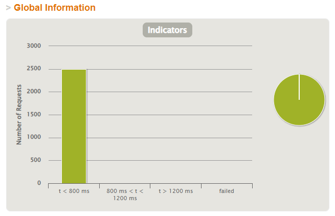
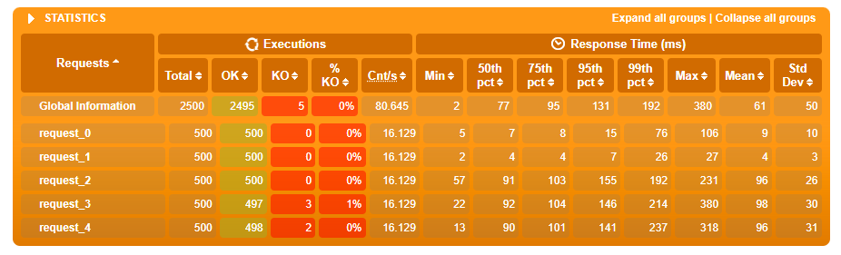

# aw10-final


Please develop a **fully functional** online purchase order system.

- It should have a superb collection of goods merchandises
- Customer can browse/search for merchandises, add selected one into his shopping cart and checkout to complete a transaction.
- User can get delivery status updates continuously.

The system should be of a **reactive architecture**, which means it should be 

-  Responsive: it should response to the user request timely.
-  Resilient: it should not be easily broken down.
-  Elastic: it should be flexible to scale out.
-  Message Driven: it should has loosely coupled components that communicates with each other asynchronously.


Please design tests/experiements to demostrate that your system fulfills such requirements as stated in [The Reactive Manifesto](https://www.reactivemanifesto.org)

**Submit your codes/documents/tests/experiements of your system.**


------


## 功能模块说明

### pos-discovery

端口号：8888

功能：注册中心，使用eureka为每个微服务提供节点

### pos-gateway

端口号：8081

功能：作为网关，将发送至网关的请求转发至每个微服务节点

### pos-products

端口号：8083

功能：商品管理模块，为系统提供商品相关的服务接口

相关api：

```markdown
/api/products
	get: 查看所有商品信息
/api/products/{productId}
	get: 根据id查询某一特定商品信息	
```

### pos-counter

端口号：8086

功能：计算模块，为系统提供计算购物车中商品总价值的服务，由pos-carts调用

### pos-carts

端口号：8089

功能：购物车模块，商品可加入购物车中，为系统提供购物车相关的服务接口

相关api：

```markdown
/api/cart
	get: 看购物车中所有商品		
/api/cart/add/{productId}
	post: 购物车中添加商品
/api/cart/checkout
	post: 结账
```

### pos-order

端口号：8087

功能：订单模块，购物车结账即产生订单，为系统提供订单相关的服务接口

相关api：

```markdown
/api/order
    post: 产生一个订单
/api/order/{id}
    get: 根据id获取订单信息
```

### pos-delivery

端口号：8088

功能：物流模块，订单产生后即生成相应的物流信息，为系统系统物流相关的服务接口

相关api：

```markdown
/api/delivery/byid/{id}
    get: 根据id获得物流信息
/api/delivery/byorder/{orderId}
    get: 根据订单id获得物流信息
```


## 性能测试

使用gatling进行性能测试，模拟500个用户的并发度，每个用户供执行5个请求，在30s内逐渐提升至500个并发用户数 

```markdown
1.查询商品列表
2.查询某个商品的具体信息
3.查看购物车
3.将商品加入购物车中
4.查看购物车
```

测试结果如下所示，所有响应的延迟均在800ms内 ：






## 响应式系统特点

### Responsive

系统可以对用户需求进行快速响应。

### Resilient

系统采用微服务架构，各个服务之间相对独立，并且断路机制的存在提高了容错性。

### Elastic

系统可以实现微服务弹性部署，灵活拓展。

### Message Driven

系统中不同服务之间采用消息驱动，使用rest接口和消息队列传递数据。